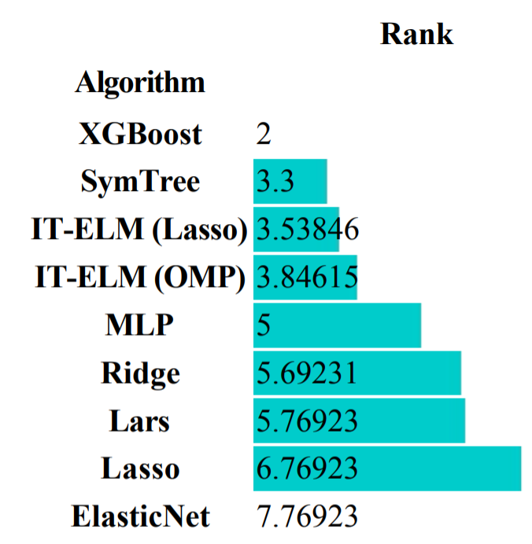
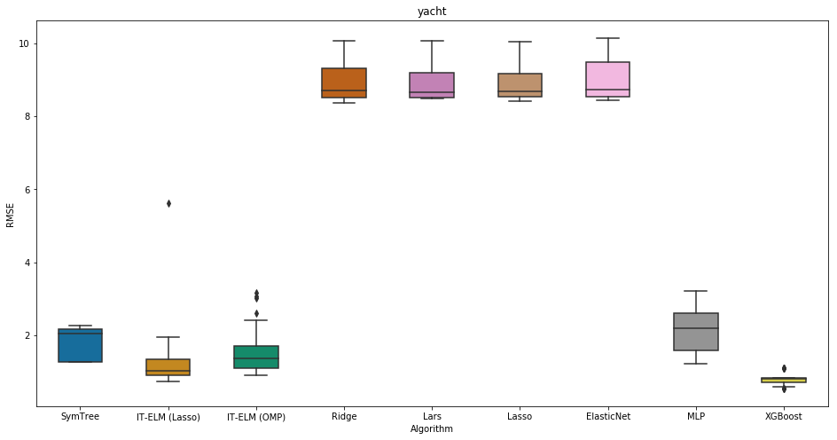
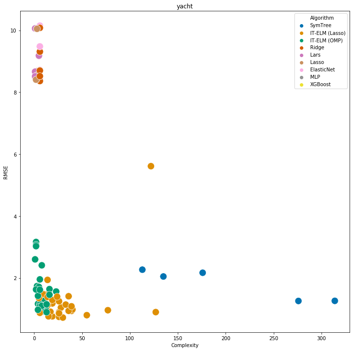
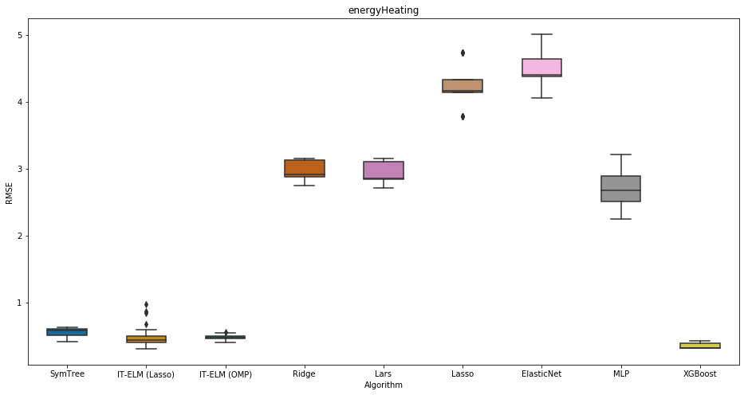
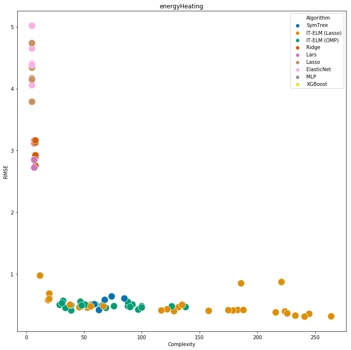
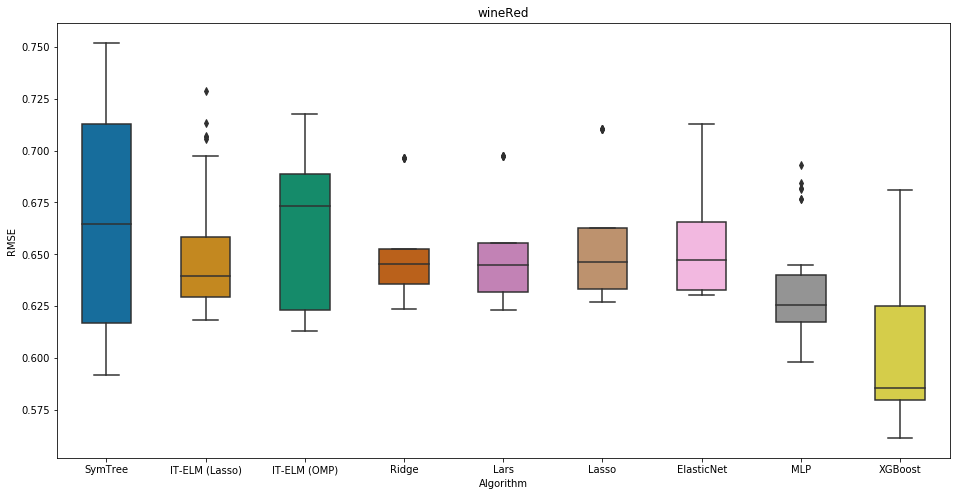
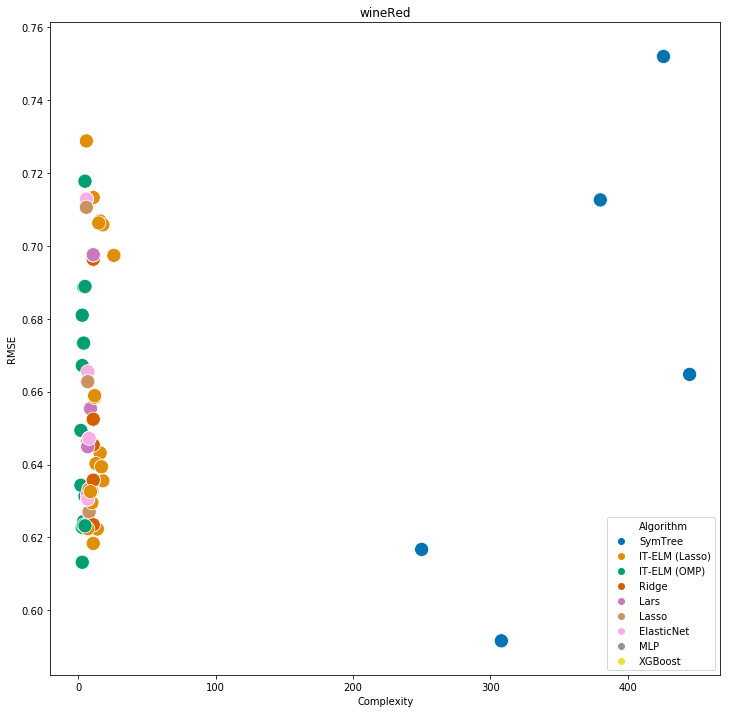

# Goals

## Find the function

Find a function $f$ that minimizes the approximation error:

$$
\begin{aligned}
& \underset{\hat{f}(\mathbf{x})}{\text{minimize}}  &\qquad& \norm{\epsilon}^2 \\
&\text{subject to} &      & \hat{f}(\mathbf{x}) = f(\mathbf{x}) + \epsilon.\\
\end{aligned}
$$


## Simple is better

* Ideally this function should be as simple as possible.
* Conflict of interests:
  - minimize approximation (use universal approximators)
  - maximize simplicity (walk away from generic approximators)
  
## The good...

The Linear Regression:

$$
\hat{f}(\mathbf{x}, \mathbf{w}) = \mathbf{w} \cdot \mathbf{x}.
$$

- Very simple (and yet useful) model.
- Clear interpretation
- The variables may be non-linear transformation of the original variables.

## ...the bad...

The mean:

$$
\hat{f} = \bar{f}(x)
$$

- The average can lie!
- It's just for the sake of the pun

## ...the Deep Learning

A deep chaining of non-linear transformations that just works!


- Universal approximation
- Alien mathematical expression

## The best?

Despite its success with error minimization, it raises some questions:

- What does the answer mean?
- What if the data is wrong?

## Symbolic Regression

Searches for a function form and the correct parameters.

Hopefully a simple function

## Symbolic Regression

**Disclaimer:** I have large experience with evolutionary algorithms, but limited with Symbolic Regression. I have start studying that last year.

## Symbolic Regression

This was my first experience with GP:

$$
\begin{aligned}
6.379515826309025e-3 + -0.00*id(x_1^-4.0 * x_2^3.0 * x_3^1.0) \\
+ -0.00*id(x_1^-4.0 * x_2^3.0 * x_3^2.0) -0.01*id(x_1^-4.0 * x_2^3.0 * x_3^3.0) \\
- 0.02*id(x_1^-4.0 * x_2^3.0 * x_3^4.0) + 0.01*cos(x_1^-3.0 * x_2^-1.0) + \\
0.01*cos(x_1^-3.0) + 0.01*cos(x_1^-3.0 * x_3^1.0) + 0.01*cos(x_1^-3.0 * x_2^1.0) \\
+ 0.01*cos(x_1^-2.0 * x_2^-2.0) - 0.06*log(x_1^-2.0 * x_2^-2.0) \\
+ 0.01*cos(x_1^-2.0 * x_2^-1.0) + 0.01*cos(x_1^-2.0 * x_2^-1.0 * x_3^1.0) \\
+ 0.01*cos(x_1^-2.0) + 0.01*cos(x_1^-2.0 * x_3^1.0) \\
+ 0.01*cos(x_1^-2.0 * x_3^2.0) + 0.01*cos(x_1^-2.0 * x_2^1.0) \\
+ 0.01*cos(x_1^-2.0 * x_2^1.0 * x_3^1.0) + -0.00*id(x_1^-2.0 * x_2^2.0) \\
- 0.00*sin(x_1^-2.0 * x_2^2.0) + 0.01*cos(x_1^-2.0 * x_2^2.0) + \ldots \\
\end{aligned}
$$

## Why?

- Infinite search space
- Redundancy
- Rugged

## Redundancy

$$
\begin{aligned}
f(x) &= \frac{x^3}{6} + \frac{x^5}{120} + \frac{x^7}{5040} \\
f(x) &= \frac{16x(\pi - x)}{5\pi^2 - 4x(\pi - x)} \\
\mathbf{f(x)} &\mathbf{= \sin{(x)}}.
\end{aligned}
$$

## Rugged space

{height=150px}

{height=150px}


## What I wanted

- A few additive terms (linear regression of transformed variables)
- Each term with as an interaction of a couple of variables
- Maximum of one non-linear function applied to every interaction (no chainings)

# Interaction-Transformation

## Interaction-Transformation

Constrains the search space to what I want: a **linear combination** of the application of different **transformation functions** on **interactions** of the original variables.

## Interaction-Transformation

Essentially, this pattern:

$$
\begin{aligned}
\hat{f}(x) &= \sum_{i}{w_i \cdot t_i(p_i(x))} \\
p_i(x)       &= \prod_{j=1}^{d}{x_j^{k_j}} \\
t_i        &= \{id, \sin, \cos, \tan, \sqrt, \log, \ldots \} \\
\end{aligned}
$$

## Interaction-Transformation

Valid expressions:

- $5.1 \cdot x_1 + 0.2 \cdot x_2$
- $3.5\sin{(x_1^2 \cdot x_2)} + 5\log{(x_2^3/x_1)}$

## Interaction-Transformation

Invalid expressions:

- $\tanh{(\tanh{(\tanh{(w \cdot x)})})}$
- $\sin{(x_1^2 + x_2)}/x_3$

## Interaction-Transformation

We can control the complexity of the expression by limiting the number of additive terms and the number of interactions:

$$
\begin{aligned}
\hat{f}(x) &= \sum_{i=1}^{k}{w_i \cdot t_i(p_i(x))} \\
p_i(x)       &= \prod_{j=1}^{d}{x_j^{k_j}} \\
s.t. & |\{k_j \mid k_j \neq 0\}| \leq n
\end{aligned}
$$

## Interaction-Transformation

Describing as an Algebraic Data Type can help us generalize to other tasks:

```haskell
IT x       = 0 | Weight (Term x) `add` (IT x)

Term x     = Trans (Inter x)
Trans      = a -> a

Inter x:xs = 1 | x s `mul` Inter xs
```

The meaning of `add` and `mul` can lead us to boolean expressions, decision trees, program synthesis.

## SymTree

Simple search heuristic:

```haskell
symtree x leaves | stop      = best leaves
                 | otherwise = symtree x leaves'
  where
    leaves' = [expand leaf | leaf <- leaves]

symtree x [linearRegression x]

```

## SymTree

```haskell
expand leaf = expand' leaf terms
  where terms = interaction leaf U transformation leaf

expand' leaf terms = node : expand' leaf leftover
  where (node, leftover) = greedySearch leaf terms
```

## IT-ELM

Interaction-Transformation Extreme Learning Machine, it generates lots of random interactions, enumerates the transformations for each interaction and then adjust the weight of the terms using $l_0$ or $l_1$ regularization.

## IT-ELM

\def\layersep{3.0cm}

\begin{tikzpicture}[shorten >=1pt,->,draw=black!50, node distance=\layersep]
    \tikzstyle{every pin edge}=[<-,shorten <=1pt]
    \tikzstyle{neuron}=[circle,fill=black!25,minimum size=22pt,inner sep=0pt]
    \tikzstyle{input neuron}=[neuron, draw=black!60, fill=green!30];
    \tikzstyle{output neuron}=[neuron, draw=black!60, fill=red!30];
    \tikzstyle{transformation neuron}=[neuron, draw=black!60, fill=blue!30];
    \tikzstyle{interaction neuron}=[neuron, draw=black!60, fill=yellow!50];
    \tikzstyle{annot} = [text width=3em, text centered]

    \foreach \name / \y in {1,...,4}
        \node[input neuron, pin=left:$x_\y$] (I-\name) at (0,-\y) {};

    \path[yshift=-0.5cm] node[interaction neuron] (In-1) at (\layersep,-1 cm) {$\Pi$};
    \path[yshift=-0.5cm] node[interaction neuron] (In-2) at (\layersep,-3 cm) {$\Pi$};
    
    \path[yshift=0.7cm] node[transformation neuron] (T-1) at (1.8*\layersep,-1 cm) {$id$};
    \path[yshift=0.7cm] node[transformation neuron] (T-2) at (1.8*\layersep,-2 cm) {$cos$};
    \path[yshift=0.7cm] node[transformation neuron] (T-3) at (1.8*\layersep,-3 cm) {$sqrt$};
    \path[yshift=0.7cm] node[transformation neuron] (T-4) at (1.8*\layersep,-4 cm) {$id$};
    \path[yshift=0.7cm] node[transformation neuron] (T-5) at (1.8*\layersep,-5 cm) {$cos$};
    \path[yshift=0.7cm] node[transformation neuron] (T-6) at (1.8*\layersep,-6 cm) {$sqrt$};

    \node[output neuron,pin={[pin edge={->}]right:$\hat{y}$}, right of=T-3] (O) {$\Sigma$};

    \path (I-1) edge node[above]{$e_{ij}$} (In-1);
    \foreach \source in {1,...,4}
        \foreach \dest in {1,...,2}
            \path (I-\source) edge (In-\dest);

    \path (In-1) edge node[above]{$1$} (T-1);
    \path (In-1) edge (T-2);
    \path (In-1) edge (T-3);
    \path (In-2) edge (T-4);
    \path (In-2) edge (T-5);
    \path (In-2) edge (T-6);

    \path (T-1) edge node[above]{$w_k$} (O);
    \foreach \source in {2,...,6}
        \path (T-\source) edge (O);

    \node[annot,above of=T-1, node distance=1cm] (ht) {Transformation};
    \node[annot,left of=ht] (hi) {Interaction};
    \node[annot,left of=hi] {Input};
    \node[annot,right of=ht] {Output};
\end{tikzpicture}


# Experiments

## Data sets

| Data set      | Features | 5-Fold / Train-Test |
|---------------|----------|---------------------|
| Airfoil       |   5      |  5-Fold             |
| Concrete      |   8      |  5-Fold             |
| CPU           |   7      |  5-Fold             |
| energyCooling |   8      |  5-Fold             |
| energyHeating |   8      |  5-Fold             |
| TowerData     |   25     |  5-Fold             |
| wineRed       |   11     |  5-Fold             |
| wineWhite     |   11     |  5-Fold             |
| yacht         |   6      |  5-Fold             |
| Chemical-I    |   57     |  Train-Test         |
| F05128-f1     |   3      |  Train-Test         |
| F05128-f2     |   3      |  Train-Test         |
| Tower         |   25     |  Train-Test         |


## Methods

For the sets with folds:

- Each algorithm was run 6 times per fold and the median of the RMSE of the test set is reported
- SymTree was run 1 time per fold (deterministic)

For the sets with train-test split:

- Each algorithm was run 10 times and the median of the RMSE for the test set is reported
- SymTree was run 1 time per data set

## Results

For a complete table:

[Binder](https://mybinder.org/v2/gh/folivetti/ITSR/master?filepath=%2FWebinar%2FExplorer.ipynb)

Cell --> Run All

## Results

{ height=250px }

## Results

{ width=420px }

## Results

{ width=420px }

## Results

{ width=420px }

## Results

{ width=420px }

## Results

{ width=420px }

## Results

{ width=420px }


## Sample equations

F05128-f1:

$$
\begin{aligned}
- 8.3 \times 10^{-3} \log{\left(p^{2} t^{2} v + 1\right)} \\
+ 1 \times 10^{-3} \sin{\left (t v^{2} \right )} \\
+ 3.1 \times 10^{-3} \cos{\left (p \right )} \\
+ 8.7 \times 10^{-3}\cos{\left (p^{2} t v^{2} \right )} \\
- 4.06\cdot 10^{-5} \tan{\left (p^{2} t^{2} v^{2} \right )}
\end{aligned}
$$

## Sample equations

CPU:

$$
0.8631183430497685 cache + 1.2023140666505465 \cdot 10^{-5} \sqrt{maxChan maxMem^{2} minMem}
$$

## Sample equations

CPU:

$$
0.5 \cdot maxRAM(MB) \sqrt{ repPerf }
$$

# Conclusions

## Resumo

A representação Interação-Transformação permite definir um espaço de busca de expressões matemáticas simples mas capaz de aproximar diversas bases de dados, sendo competitivo com algoritmos do estado-da-arte de regressão.

Além disso, o algoritmo SymTree é capaz de encontrar uma boa expressão IT com poucas iterações, sendo um algoritmo simples e computacionalmente leve.

## Future research

Muitas possibilidades de estudos futuros:

- Generalizar a representação como uma tipo de dado algébrico
- Utilizar essa representação em outros contextos
- Aumentar o espaço de busca permitindo outras expressões simples ainda não compreendidas
- Criar novos algoritmos de busca para esse espaço de busca
- Muitos outros...

## Try it!

You can try a lightweight version of SymTree at:

[https://galdeia.github.io/](https://galdeia.github.io/)

It works even on midrange Smartphones!

## Some problems with the provided data sets

The *folds* data sets were provided by some authors that extensively used for GP performance comparison, but:

Forest Fire contains many samples with target $=0$, because most of the time the forests did not caught fire.

CPU should use the last but one column as the target variable, the last column is just the predicted values from the original paper.

